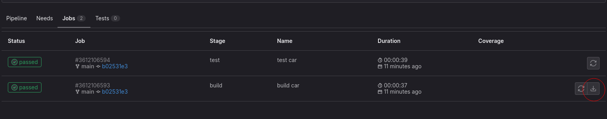

# Udemy GitLab CI: Pipelines, CI/CD and DevOps for Beginners

## Gitlab CI File

In order to create a pipeline in gitlab CI, we need to create a file that
defines that pipeline.

The filename to define a pipeline for gitlab CI is called `.gitlab-ci.yml`.

`.yml` is an extension for file type `yaml` which is a human-readable
data-serialization language. It is commonly used for configuration files and
in application where data is being stored or transmitted.

## Gitlab Pipeline

In order for gitlab to do anything, we need to specify a job. A job in here
basically means a task that gitlab should do for us.

Let's say that we want gitlab to build a car for us, we can specify the job on
`.gitlab-ci.yml` like this:
```yaml
build car:
  script:
    - mkdir build
    - cd build
    - echo 'chassis' >> car.txt
    - echo 'engine' >> car.txt
    - echo 'whells' >> car.txt
    - <other-shell-command>
```

As soon as we create the `.gitlab-ci.yml`, gitlab will run the pipeline. The
indicator that our pipeline running is something like this:<br>


If we want to see the current progress of our pipeline, we can click the icon
above. If we check the progress of our pipeline, we will see the previous job
we define, which is `build car`:<br>


The tool that running the job we have defined is called *runner*.

Now, let's say we want to test if the job `build car` was creating the file
`car.txt`. We can define another job, like this:
```yaml
test car:
  script:
    - test -f build/car.txt
    - grep 'chassis' build/car.txt
    - grep 'engine' build/car.txt
    - grep 'wheels' build/car.txt
```

If we combine both `build car` and `test car` into `.gitlab-ci.yml`, we will
get something like this:
```yaml
build car:
  script:
    - mkdir build
    - cd build
    - echo 'chassis' >> car.txt
    - echo 'engine' >> car.txt
    - echo 'whells' >> car.txt

test car:
  script:
    - test -f build/car.txt
    - grep 'chassis' build/car.txt
    - grep 'engine' build/car.txt
    - grep 'wheels' build/car.txt
```

If you notice, we haven't specified in which order those jobs should be
executed. By default, **gitlab will try to run the jobs in parallel**.

So, to specify the order in which jobs should be executed, we need to defined
`stages`, like this:
```yaml
stages:
  - build
  - test
```

> Please keep in mind that **the `stages` order is important**.

After that, we need to specify the stage name for jobs `build car` and `test
car`, like this:
```yaml
build car:
  stage: build
  script:
    - ...

test car:
  stage: test
  script:
    - ...
```

If we combine all of them, it will look like this:
```yaml
stages:
  - build
  - test

build car:
  stage: build
  script:
    - mkdir build
    - cd build
    - echo 'chassis' >> car.txt
    - echo 'engine' >> car.txt
    - echo 'whells' >> car.txt

test car:
  stage: test
  script:
    - test -f build/car.txt
    - grep 'chassis' build/car.txt
    - grep 'engine' build/car.txt
    - grep 'wheels' build/car.txt
```

Now if we see our pipeline:<br>


We will notice that it is quite different from before. Now we have two
separate `stage` which is `build` stage and `test` stage.

> We can have multiple jobs in one `stage` which can run in parallel and we
> can have as many stages as we want.
>
> If the stage is not specified, the job will be assigned to `test` stage.

After waiting for a bit, we will see that our job `test car` in stage `test`
is failing:<br>


If we take a look inside, we will see which step that failing, like this:<br>


It seems the first step, where we check if the file `car.txt` in directory
`build` exist failed. So, why is it failed? **The jobs that we are running
inside the pipeline is kind of independent from one and another**, the jobs
will not exchange any data if we did not specify to exchange data.

So what happen is, the previous job, the `build car` job create a file but we
have not specify what should happen with the file that was created. After the
`build car` job terminated, all the files would be removed. And that is why
when the `test car` job running, the test did not find the file we are looking
for, and then the test failed and did not continue the remaining test.

To solve this, we need to specify the `build car` job to save the file into a
a storage (which is called [job
artifact](https://docs.gitlab.com/ee/ci/pipelines/job_artifacts.html) in
gitlab) and not throw it away after the job done.

To do that, we need to add `artifacts` like this:
```yaml
build car:
  stage: build
  script:
    - ...
  artifacts:
    paths:
      - build/
```

What we do above is that we tell gitlab to save the entire `build` directory.

Now, every job is passing:<br>


We can download the artifacts that a job already made, so we can inspect the
file that have been generated by the job we created.

To download the artifacts, we can go inside the pipeline and then select the
`jobs` tab and click the icon download (like the icon in the red circle
below): <br>


or we can go inside the job that created the artifacts (in this case is the
`build car` job), and then click the job artifacts on the right:<br>


> Inside the job that created artifacts, not only we can download the
> artifacts, but we can also browse the artifacts directory.

The build directory that we created **won't be added to the repository**, they
are only created in the *pipeline* and we decided we want to save them as
*artifacts*. Those *artifacts* are independent of the git repository, they are
available separately for download or anything else.

Also, please keep in mind that **we can only save the file or directory
relative to current working directory where the job started**. You can
check the current working directory where the job started in the step
*Fetching changes with git depth set to 20...*, which will output something
like this:
```sh
Initialized empty Git repository in /builds/bruhtus/gitlab-ci-experiment/.git/
```

in the example above, the current working directory where the job started
would be in `/builds/bruhtus/gitlab-ci-experiment`.

> When we specify directory for artifacts paths, we would see the matching
> files and directory like this
> `build/: found 2 matching files and directories` which means 1 directory
> `build/` and 1 file. So **any directories or files would be included in the
> count matching**. Please keep that in mind.

## Gitlab Architecture

The first thing we need for gitlab to work is the gitlab server, and
everything that we do inside git repository will be saved in a database.

As soon as we create a pipeline, that pipeline will be delegated to
*a gitlab runner*. The gitlab server does not do the heavy lifting of actually
running the pipeline command, it only make sure the gitlab runner picking up
the pipeline job and executed like instructed in `.gitlab-ci.yml`.

That mechanism allows us to have a scalable architecture because we can add or
remove as many gitlab runner as we needed.


## Continuous Integration (CI) and Continuous Deployment (CD)

Continuous integration is basically continuously integrating our code with
other people's code.

By using continuous integration, it means that every time we make a change to
the code, that code is being integrated with the code that others made.
Usually the way of integrating the code is to see if the build or test is
still running.

Continuous deployment or continuous delivery is basically continuously build
our code and deploy our code to the preproduction or testing environment. And
only by manual intervention we can deploy a specific changes to production
environment.

Continuous integration enable us to detect errors earlier in the development
process, faster feedback loop, and reduce integration problems.

A combination of continuous integration and continuous deployment enable us
to ensure every changes are releasable (by testing that it can be deployed),
reduce risk of a new deployment, deliver features much faster.

## Environment Variable for Managing Secrets

We generally do not want to keep any secrets or credentials inside git
repository. Gitlab CI offers us a convenient way to store secrets or
credentials using gitlab CI variables.

We can add gitlab CI variables in settings CI/CD section, like below:<br>


Inside the settings CI/CD section, we will see `Variables` section like
this:<br>


After that, we can just click `Expand` and then add the environment variable
we want.

### Gitlab CI Predefined Environment Variable

Gitlab provide us with some predefined environment variable which we can use
to customize our CI. We can check gitlab CI predefined environment variable
[here](https://docs.gitlab.com/ee/ci/variables/predefined_variables.html).

## Gitlab CI Cache

To make our pipeline a little bit faster, we can use cache to store our
dependencies.

The basic syntax for gitlab CI cache would be like this:
```yaml
cache:
  paths:
    - node_modules
  key:
    files:
      - package-lock.json
```

For more info about gitlab CI cache, we can take a look at the documentation
[here](https://docs.gitlab.com/ee/ci/caching/).

To clear cache, we can do that inside section `CI/CD` and then select
`Pipelines`, and click `Clear runner cache`.

## Gitlab Cache vs Artifacts

Use cache for dependencies, like packages you download from the internet.
Cache is stored where GitLab Runner is installed and uploaded to S3 if
distributed cache is enabled.

Use artifacts to pass intermediate build results between stages. Artifacts are
generated by a job, stored in GitLab, and can be downloaded.

> Both artifacts and caches define their paths relative to the project
directory, and can’t link to files outside it.

For more info, we can take a look at the documentation
[here](https://docs.gitlab.com/ee/ci/caching/#cache-vs-artifacts).

## Basic YAML

YAML is basically a combination of key and value. We can assign the value as
string like this:
```yaml
name: Anu
address: 'nganu'
```

or number like this:
```yaml
age: 69
```

or boolean like this:
```yaml
isMale: true
```

or list (array) like this:
```yaml
gadget:
  - laptop
  - smartphone
  - ipad

food: [fried rice, indomie, penyetan]
```

We use indentation to define a property for an object. For example if we use
indentation, like this:
```yaml
person:
  name: 'Anu'
  address: 'nganu'
  friends:
    - name: 'Itu'
      age: 69
    - name: 'Ini'
      age: 69
```

it means that a `person` has property `name`, `address`, and `friends`. In
`friends` case, rather than a list of string, it is a list of object.

To add a comment in YAML file, we can use `#` like this:
```yaml
# This is a comment
name: 'Anu'
```

## Disable Job on Gitlab CI

We can disable the job by adding the `.` (dot) in front of a job name.

Let's say we have this gitlab CI configuration:
```yaml
stages:
  - build
  - test

build car:
  stage: build
  script:
    - mkdir build
    - cd build
    - echo 'chassis' >> car.txt
    - echo 'engine' >> car.txt
    - echo 'whells' >> car.txt

test car:
  stage: test
  script:
    - test -f build/car.txt
    - grep 'chassis' build/car.txt
    - grep 'engine' build/car.txt
    - grep 'wheels' build/car.txt
```

and we want to disable the job `test car`, we can disable job `test car` like
this:
```yaml
...

.test car:
  state: test
  ...
```

## YAML Anchors

Anchors is basically let us use other property value in another property. For
example:
```yaml
person:
  name: &shared 'Anu'
  myName: *shared
```

in the example above, we shared the `Anu` value in `name` property to `myName`
property as well. So we don't need to manually duplicate the value. Also, if
we change the `name` property value to something else, the value in `myName`
property also changed.

We can also share the entire object, like this:
```yaml
similar: &shared
  city: tokyo
  country: japan

person-1:
  name: 'Anu'
  <<: *shared

person-2:
  <<: *shared
  name: 'Itu'
```

> If there is duplicate property, then the last property will override the
> previous property.

## Gitlab CI Extends

Other than anchors, we can use `extends` keyword to reuse configuration in
multiple job.

For example:
```yaml
.test:
  rules:
    - if: $CI_PIPELINE_SOURCE == 'merge_request_event'

merge-request-test:
  extends: .test
  script: echo 'testing merge request'
```

To exclude a property when using `extends`, we must assign those property to
`null`. For example:
```yaml
.base:
  variables:
    VAR!: var1
  script: echo 'test begin'

test-1:
  extends: .base
  variables:
    VAR1: test1

test-2:
  extends: .base
  variables: null
```

> If there is duplicate property, then the last property will override the
> previous property.

## Extra Notes

If we have previous pipeline from previous commit still running, and then we
make new commit and start new pipeline, the previous pipeline would still be
running if we did not stop it manually. In some cases, this scenario can cause
the new pipeline to failed. So please keep that in mind.

## References

- [Udemy course](https://www.udemy.com/course/gitlab-ci-pipelines-ci-cd-and-devops-for-beginners/).
- [Gitlab artifacts documentation](https://docs.gitlab.com/ee/ci/pipelines/job_artifacts.html).
- [Gitlab ci yaml keywords](https://docs.gitlab.com/ee/ci/yaml/index.html).
- [Yaml optimization](https://docs.gitlab.com/ee/ci/yaml/yaml_optimization.html).
